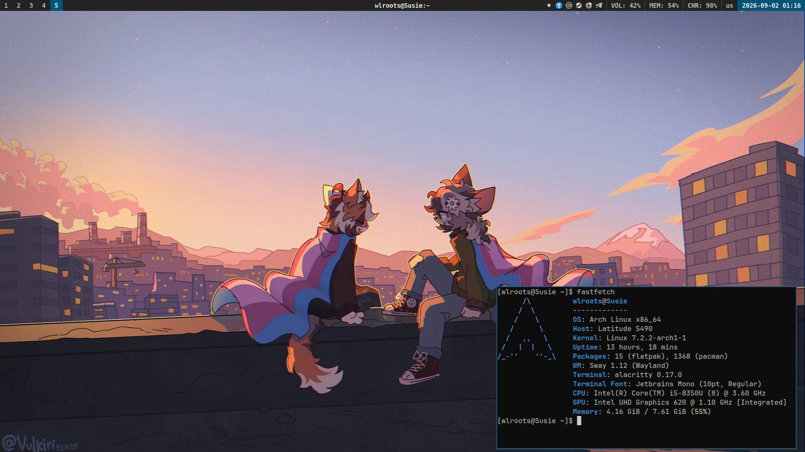

# wlroots' Sway Dotfiles

Minimalist Sway & Wayland configuration for Arch Linux. Proven to work with minimal RAM



## Stack

- **WM:** Sway
- **Terminal:** Alacritty
- **Bar:** Waybar
- **Launcher:** Fuzzel
- **Font:** JetBrains Mono & Noto Sans

## Keybindings

Keybindings are basic, sway defaults, you can read ~/.config/sway/config if you want to  
Heres some, tho  
- `Super + Return` — Terminal (Alacritty)
- `Super + D` — Application Launcher (Fuzzel)
- `Super + Shift + Q` — Close focused window
- `Super + Shift + E` - Logout menu

## Quick Install

> [!WARNING]
> This script is intended strictly for **Arch Linux** (or Arch-based distros) and requires a **non-root user with `sudo` privileges**. It will install official packages via `pacman` and **AUR packages** via `yay`.
> Running the installer will overwrite existing configuration files. If your home directory is already a bare git repository, it will automatically back up `~/.dotfiles` to `~/.dotfiles-backup`.

### One-liner
Run the automated installation script:

```bash
bash <(curl -sSL https://wlroots.github.io/dotfiles/install.sh)
```

### Manual Installation
If you prefer to inspect the code locally before running:
```bash
git clone https://github.com/wlroots/dotfiles.git
cd dotfiles
chmod +x install.sh
...
./install.sh
```

## Credits
- **Desktop Showcase Wallpaper:** Artwork by [Vulkiri](https://x.com/Vulkiri).
- **OneShot WME Wallpapers:** Official assets from *OneShot: World Machine Edition*.
- **Deltarune Lake (`DELTARUNE/lake.png`) wallpaper:** Artwork sourced from Steam Workshop (DELTARUNE - Rainy Day) by [IndyJen](https://steamcommunity.com/sharedfiles/filedetails/?id=3499689331).
- **Slime Rancher (`wallpaper_5k_slime_rancher.jpg`) wallpaper:** Bonus media content from *Slime Rancher*.

## License
This repo and the dotfiles itself are licensed by CC0 license

## Repositories

- **Installer & Scripts:** [wlroots/dotfiles](https://github.com/wlroots/dotfiles)
- **Bare Home Repository:** [wlroots/dotfiles-home](https://github.com/wlroots/dotfiles-home)
